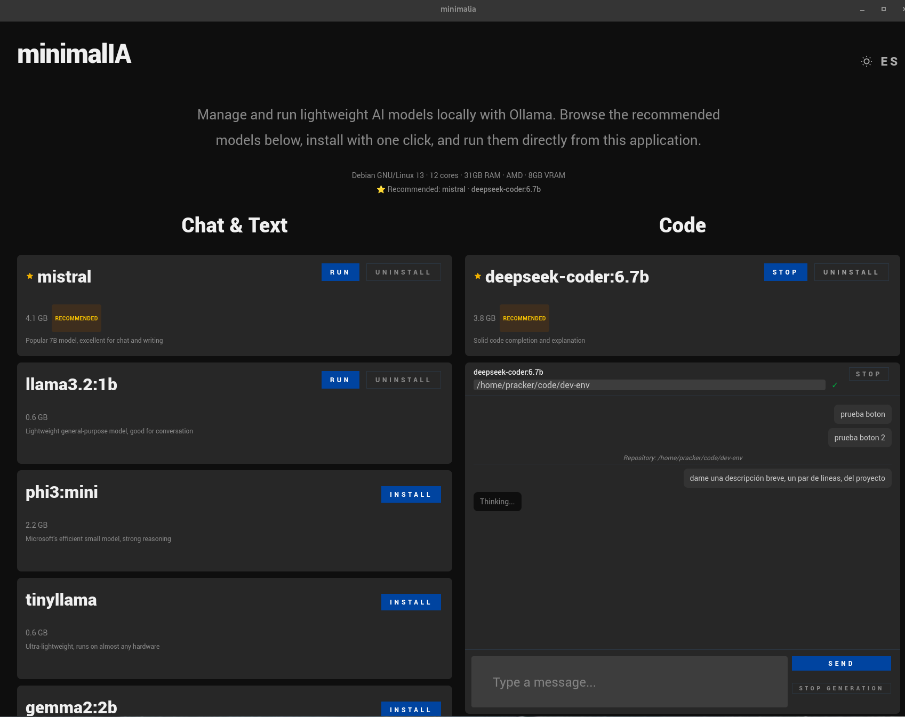

# minimalIA

**minimalIA** es un gestor de modelos de IA lanzados con **Ollama**. Construido con **Tauri v2** (Rust) + **React** (TypeScript), permite instalar, ejecutar y desinstalar modelos locales de forma sencilla. Si Ollama no está en ejecución, la aplicación te guía para instalarlo.



---

## Roadmap

### Fase 1 — Inicialización

- [x] Scaffold Tauri v2 + React + TypeScript con `create-tauri-app`
- [x] Instalar dependencias del sistema Linux (webkit2gtk, librsvg2, etc.)
- [x] Verificar compilación Rust (`cargo check`) y build completo (`.deb`, `.rpm`)
- [x] Configurar **Tailwind CSS v4** con `@tailwindcss/vite`

### Fase 2 — Stack frontend

- [x] Integrar **@tanstack/react-query** (React Query v5) — `QueryClientProvider` en `main.tsx`
- [x] Integrar **zustand** para manejo de estado global
- [x] Store de ejemplo: `src/store/use-counter.ts` → migrado a `src/features/theme/store.ts`

### Fase 3 — Sistema de diseño Elevate

- [x] Importar base CSS **Elevate10** desde `/home/pracker/Descargas/Elevate10`
- [x] Extraer tipografía: fuentes **Roboto** (8 pesos) y **Domine** (regular, bold)
- [x] Crear `src/styles/elevate-fonts.css` — declaraciones `@font-face`
- [x] Crear `src/styles/elevate-base.css` — helpers y resets
- [x] Crear `src/styles/elevate-theme.css` — sistema de colores, tipografía, botones, formularios con variables CSS

### Fase 4 — Tema oscuro/claro

- [x] Store Zustand `use-theme.ts` con persistencia a `localStorage`
- [x] Respeta `prefers-color-scheme` del sistema operativo
- [x] Aplica clase `dark` en `<html>` para activar variables CSS del tema oscuro
- [x] Alternar tema con botón sol/luna en el header
- [x] Variables CSS adaptadas para light/dark en `elevate-theme.css`
- [x] Extraer `ThemeToggle` a `src/features/theme/ThemeToggle.tsx` como <button> semántico

### Fase 5 — Tooling y refactor

- [x] Instalar **Biome** (`@biomejs/biome`) como linter + formateador
- [x] Configurar `biome.json` — sin punto y coma (`semicolons: "asNeeded"`), indentación space 2
- [x] Reemplazar todos los `style={}` inline por clases Tailwind con valores arbitrarios (`bg-[var(--elevate-bg)]`, `font-[roboto-black]`, etc.)
- [x] Corregir colisión de capas CSS: `@layer utilities` de Tailwind v4 vs reglas sin capa de elevate-theme.css — usar `!` prefix en clases para `!important`

### Fase 6 — Internacionalización (i18n)

- [x] Instalar `react-i18next` + `i18next` + `i18next-browser-languagedetector`
- [x] Crear `src/i18n/i18n.ts` con configuración (fallback inglés, detección automática)
- [x] Crear traducciones EN/ES en `src/i18n/locales/`
- [x] Crear `LangToggle` en `src/features/i18n/LangToggle.tsx` — botón EN/ES a la derecha del selector de tema
- [x] Reemplazar textos estáticos por `useTranslation()` en App.tsx y ThemeToggle

### Fase 7 — Gestor de modelos Ollama

- [x] Detectar si Ollama está en ejecución (`GET /api/tags` a `localhost:11434`)
- [x] Mostrar botón "Instalar Ollama" con enlace a `ollama.com/download` si no está disponible
- [x] Listar modelos instalados con nombre y tamaño
- [x] Reemplazar contenido plantilla por gestor de modelos
- [x] Catálogo de modelos ligeros recomendados en dos categorías: Chat y Código
- [x] Botón "Instalar" que descarga el modelo vía `POST /api/pull`
- [x] Botón "Ejecutar" que prueba el modelo vía `POST /api/generate`
- [x] Los modelos instalados se detectan automáticamente y muestran "Ejecutar" en vez de "Instalar"
- [x] Spinner de carga + texto "Instalando..." en el botón mientras se descarga un modelo
- [x] Solo un modelo puede instalarse a la vez; los demás botones se deshabilitan
- [x] Solo un modelo por categoría (chat/code) puede ejecutarse a la vez
- [x] Botón "Desinstalar" junto a "Ejecutar" para eliminar modelos vía `DELETE /api/delete`
- [x] Errores manejados silenciosamente — los botones vuelven a su estado inicial
- [x] Extraer `ModelCard` y `ModelCategorySection` como componentes independientes
- [x] Extraer `useModelManager` hook que encapsula toda la lógica de estado (instalando, ejecutando, resultados)

### Fase 8 — Refactor de arquitectura (Screaming Architecture + SOLID)

- [x] Eliminar `src/components/OllamaManager.tsx` duplicado (no importado)
- [x] Mover `models.ts` a `src/features/ollama/catalog.ts` (separar datos de componentes)
- [x] Renombrar `use-ollama.ts` → `api.ts`, `use-model-manager.ts` → `manager.ts`
- [x] Agrupar todo el código de Ollama en `src/features/ollama/` (componentes, hooks, catálogo)
- [x] Mover tema a `src/features/theme/` (store + componente juntos)
- [x] Mover i18n a `src/features/i18n/` (config + locales + LangToggle juntos)
- [x] Eliminar directorios genéricos `components/`, `hooks/`, `data/`, `store/`
- [x] Aplicar principios SOLID: SRP, OCP, DIP
- [x] Aplicar KISS: estructura plana, imports cortos (`./api` vs `../../hooks/use-ollama`)
- [x] Biome y TypeScript pasan sin errores

### Fase 9 — Sistema e información del sistema

- [x] Comando Rust `get_system_info` con `sysinfo` crate — detecta OS, CPU, RAM
- [x] Detección de GPU multiplataforma: Linux (sysfs + lspci + nvidia-smi), macOS (`system_profiler`), Windows (PowerShell + wmic)
- [x] Componente `SystemInfo` con información de sistema y modelos recomendados
- [x] Recomendación dinámica de modelos según RAM/VRAM máxima
- [x] Ordenación de modelos: el recomendado aparece primero
- [x] Estrella SVG + badge "Recommended" en el modelo recomendado

### Fase 10 — Chat con modelos

- [x] `ChatView` con historial de mensajes, input y botón enviar
- [x] Integración con `POST /api/generate` de Ollama
- [x] AbortController para cancelar generación en curso
- [x] Auto-scroll al último mensaje mediante `useEffect`
- [x] Botón "Stop" en cabecera para cerrar el chat
- [x] Botón "Detener generación" que aborta la respuesta sin cerrar el chat
- [x] Al desinstalar un modelo con el chat abierto, primero se cierra el chat

### Fase 11 — Asistente de código con contexto de repositorio

- [x] Campo de ruta de repositorio en el chat de código
- [x] Validación de ruta contra el sistema de archivos (`validate_path`)
- [x] Comando Rust `get_repo_context` — escanea el directorio (3 niveles, salta `.`/`node_modules`/`target`)
- [x] Lectura de archivos clave (`package.json`, `Cargo.toml`, `README.md`, etc.)
- [x] Indicador visual de ruta válida/inválida (✓/✗)
- [x] Contexto visible en el chat como mensaje "Repositorio: /ruta"
- [x] El modelo recibe el árbol del proyecto + contenido de archivos clave

### Fase 12 — Limpieza al cerrar la aplicación

- [x] Al cerrar el chat, se descarga el modelo de la RAM de Ollama (`keep_alive: "0m"`)
- [x] Al cerrar la ventana, `on_window_event` ejecuta `systemctl --user stop ollama`
- [x] Se intenta `pkill ollama` y `sudo -n pkill ollama` como fallback
- [x] Servicio de usuario systemd para Ollama (`~/.config/systemd/user/ollama.service`)
- [x] Documentación de requisitos e instalación de Ollama como servicio de usuario

### Fase 13 — Inicio automático de Ollama

- [x] Comando Rust `start_ollama` que ejecuta `systemctl --user start ollama`
- [x] Al abrir la app, si Ollama no responde, se intenta iniciar automáticamente
- [x] Botón "Iniciar Ollama" en la pantalla de instalación para reintento manual
- [x] Servicio de usuario con `loginctl enable-linger` para arranque automático al iniciar sesión

---

## Referencias

| Recurso | Uso |
|---|---|
| **[Tauri v2](https://v2.tauri.app)** | Framework de escritorio multiplataforma (Rust + webview) |
| **[React 19](https://react.dev)** | UI declarativa con TypeScript |
| **[Vite](https://vite.dev)** | Build tool y dev server |
| **[Tailwind CSS v4](https://tailwindcss.com)** | Utilidades CSS, integrado via `@tailwindcss/vite` |
| **[@tanstack/react-query](https://tanstack.com/query/latest)** | Data fetching y caché asíncrona |
| **[Zustand](https://github.com/pmndrs/zustand)** | Estado global liviano |
| **[react-i18next](https://react.i18next.com)** | Internacionalización (i18n) con detección de idioma del navegador |
| **[Ollama](https://ollama.com)** | Ejecución local de modelos de IA |
| **[Biome](https://biomejs.dev)** | Linter y formateador de código |
| **[Elevate10](https://www.styleshout.com)** | Plantilla landing page — fuentes Roboto/Domine, sistema de diseño base |
| **Font Awesome** | (disponible en Elevate, no usado — se prefieren SVG inline) |

---

## Requisitos

- **Rust** (≥1.70) con `cargo`
- **Node.js** (≥18) con `npm`
- **Ollama** — [Descargar e instalar](https://ollama.com/download)
- **Linux**: `libwebkit2gtk-4.1-dev`, `librsvg2-dev`, `build-essential`, `libssl-dev`, `libayatana-appindicator3-dev`

### Configurar Ollama como servicio de usuario (Linux)

Para que la aplicación pueda detener Ollama al cerrarse, debe ejecutarse como **servicio de usuario systemd**. Si ya tienes Ollama instalado como servicio del sistema, migra al de usuario:

```sh
# Detener el servicio del sistema (si existe)
sudo systemctl stop ollama
sudo systemctl disable ollama

# Crear el servicio de usuario
mkdir -p ~/.config/systemd/user

cat > ~/.config/systemd/user/ollama.service << 'EOF'
[Unit]
Description=Ollama Service
After=network-online.target

[Service]
ExecStart=/usr/local/bin/ollama serve
Restart=on-failure
RestartSec=3

[Install]
WantedBy=default.target
EOF

# Iniciar el servicio de usuario
systemctl --user daemon-reload
systemctl --user enable ollama
systemctl --user start ollama

# Asegurar que arranque al iniciar sesión
loginctl enable-linger $(whoami)
```

> **Nota**: En macOS y Windows la app intentará detener Ollama mediante `pkill` / `taskkill` respectivamente.

```sh
# Debian/Ubuntu
sudo apt install libwebkit2gtk-4.1-dev build-essential curl wget file \
  libxdo-dev libssl-dev libayatana-appindicator3-dev librsvg2-dev
```

Para macOS y Windows consulta la [guía de prerequisitos de Tauri](https://v2.tauri.app/start/prerequisites/).

---

## Desarrollo

```sh
# Clonar e instalar dependencias
npm install

# Iniciar servidor de desarrollo con hot-reload (Tauri + Vite)
npm run tauri dev

# Build de producción (binario + paquetes .deb/.rpm/.appimage)
npm run tauri build

# Solo frontend (para pruebas rápidas en navegador)
npm run dev
```

El comando `npm run tauri dev` levanta Vite en el puerto 1420 y abre la ventana nativa de Tauri con hot-reload en ambos lados (Rust y React).

```sh
# Linting y formato con Biome
npm run lint
npm run format
```

---

## Estructura del proyecto

```
minimalIA/
├── src/                    # Frontend React + TypeScript
│   ├── assets/fonts/       # Fuentes Roboto y Domine (woff/woff2)
│   ├── features/
│   │   ├── ollama/         # Gestión de modelos Ollama
│   │   │   ├── api/
│   │   │   │   ├── ollama.ts    # Ollama HTTP API calls (sendChatMessage)
│   │   │   │   └── tauri.ts     # Tauri invoke wrappers (getSystemSpecs, validateRepoPath, getRepoContext)
│   │   │   ├── domain/
│   │   │   │   └── types.ts     # Shared type definitions
│   │   │   ├── hooks/
│   │   │   │   └── useChat.ts   # Chat state management hook
│   │   │   ├── api.ts           # React Query hooks (useOllamaStatus, usePullModel, useDeleteModel)
│   │   │   ├── catalog.ts       # Catálogo de modelos recomendados
│   │   │   ├── manager.ts       # Hook useModelManager (estado y operaciones)
│   │   │   ├── recommendations.ts  # Lógica de recomendación de modelos
│   │   │   ├── system.ts        # Detección de sistema con fallback browser
│   │   │   ├── use-system-specs.ts
│   │   │   ├── ChatView.tsx     # Ventana de chat (delgada, delega en useChat)
│   │   │   ├── InstallOllama.tsx
│   │   │   ├── ModelCard.tsx
│   │   │   ├── ModelCategorySection.tsx
│   │   │   ├── OllamaManager.tsx
│   │   │   └── SystemInfo.tsx
│   │   ├── theme/          # Modo oscuro/claro
│   │   │   ├── store.ts        # Estado del tema (Zustand)
│   │   │   └── ThemeToggle.tsx
│   │   └── i18n/           # Internacionalización EN/ES
│   │       ├── i18n.ts         # Configuración de react-i18next
│   │       ├── LangToggle.tsx   # Selector de idioma
│   │       └── locales/
│   │           ├── en.json      # Traducciones inglés
│   │           └── es.json      # Traducciones español
│   ├── styles/
│   │   ├── elevate-fonts.css
│   │   ├── elevate-base.css
│   │   └── elevate-theme.css
│   ├── App.tsx
│   ├── App.css
│   └── main.tsx
├── src-tauri/              # Backend Rust (Tauri)
│   ├── src/lib.rs
│   ├── Cargo.toml
│   └── tauri.conf.json
├── index.html
├── biome.json               # Configuración de Biome (linter + formateador)
├── package.json
├── vite.config.ts
└── README.md
```

---

## Licencia

MIT License

Copyright (c) 2026

Permission is hereby granted, free of charge, to any person obtaining a copy
of this software and associated documentation files (the "Software"), to deal
in the Software without restriction, including without limitation the rights
to use, copy, modify, merge, publish, distribute, sublicense, and/or sell
copies of the Software, and to permit persons to whom the Software is
furnished to do so, subject to the following conditions:

The above copyright notice and this permission notice shall be included in all
copies or substantial portions of the Software.

THE SOFTWARE IS PROVIDED "AS IS", WITHOUT WARRANTY OF ANY KIND, EXPRESS OR
IMPLIED, INCLUDING BUT NOT LIMITED TO THE WARRANTIES OF MERCHANTABILITY,
FITNESS FOR A PARTICULAR PURPOSE AND NONINFRINGEMENT. IN NO EVENT SHALL THE
AUTHORS OR COPYRIGHT HOLDERS BE LIABLE FOR ANY CLAIM, DAMAGES OR OTHER
LIABILITY, WHETHER IN AN ACTION OF CONTRACT, TORT OR OTHERWISE, ARISING FROM,
OUT OF OR IN CONNECTION WITH THE SOFTWARE OR THE USE OR OTHER DEALINGS IN THE
SOFTWARE.
